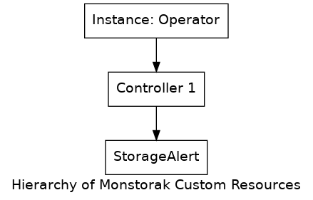

This document describes the set of [Custom Resource Definitions
(CRDs)](https://kubernetes.io/docs/concepts/extend-kubernetes/api-extension/custom-resources/)
that will be used to deploy mixins for a storage system. The actual implementation
of the resources described here will be phased in during development. The
purpose of this document is to provide the overall structure, ensuring the end
result provides necessary configurability in a user-friendly manner.

# Overview

A single Monstorak operator can take care of deployment of mixins for one or
more storage systems. Each storage cluster should already be deployed within
the kubernetes cluster, or the storage cluster could be running on hosts outside
of kubernetes cluster. The capabilities of the operator remains same in both
the modes of the deployment of storage cluster and the same set of CRDs should
be used for both the cases.

A given deployment configuration for storage systems contains a Custome Resource
which contains configurations options like whether alerts are enabled, if
dashboards are enabled, name of the storage system and version details of storage
system.



# Custom Resources Definitions

This section describes the fields in each of the custom resources.

## **StorageCatelog**

### *Singular: StorageCatalog, Plural:StorageCatalogs*

The StorageCatalog custom resoyrce defines a storage system for which mixins could
be deployed using the operator. This CR captures the names of the storage system,
its supported version details and flag whether only alerts, only dashboards or
both need to be deployed.

```YAML
apiVersion: mixins.monstorak.org/v1alpha1
kind: StorageCatalog
spec:
  - storage: "ceph"
    version: ["mimic", "nautilus"]
    alert: true
    dashboard: true
```

## **StorageAlert**

### *Singular: StorageAlert, Plural: StorageAlerts*

The StorageAlert custom resource defines the alerts configuration for a storage
system. This basically captures details like for which version alerts are enabled,
if alerts enabled then which namepsace alerting rules should be deployed and
any specific lables to be used while deployment.

```YAML
apiVersion: mixins.monstorak.org/v1alpha1
kind: StorageAlert
spec:
  - storage: "ceph"
    - version: "mimic"
      alert: false
    - version: "nautilus"
      alert: true
      prometheus:
      - namespace: "monitoring"
      - lable: "prometheus:k8s"
```

## **StorageDashboard**

### *Singular: StorageDashboard, Plural: StorageDashboards*

The StorageDashboard customer resource defines the dashboards configuration for
a storage system. This basically captures details like for which version
dashboards are enabled, if dashboards enabled then which namepsace the
dashboards should be deployed and any specific lables to be used while deployment.

```YAML
apiVersion: mixins.monstorak.org/v1alpha1
kind: StorageDashboard
spec:
  - storage: "ceph"
    - version: "mimic"
      dashboard: false
    - version: "nautilus"
      dashboard: true
      grafana:
      - namespace: "monitoring"
      - label: "grafana:k8s"
```

## **StorageMonitoringPlan**

### *Singular: StorageMonitoringPlan, Plural: StorageMonitoringPlans*

The StorageMonitoringPlan custom resource defines a plan which shoul be
executed by operator controller to deploy the required mixins artifacts.

```YAML
apiVersion: mixins.monstorak.org/v1alpha1
kind: StorageMonitoringPlan
spec:
  - storage: "ceph"
  - version: "mimic"
    - alert: false
    - dashbaord: false
  - version: "nautilus"
    - alert: true
    - dashboard: true
```

All CRs live within the `mixins.monstorak.org` group and have version
`v1alpha1`. The storage cluster and all its artifacts are suposed to be
deployed in single namespace.  The `spec` field provides the main
configuration options.
