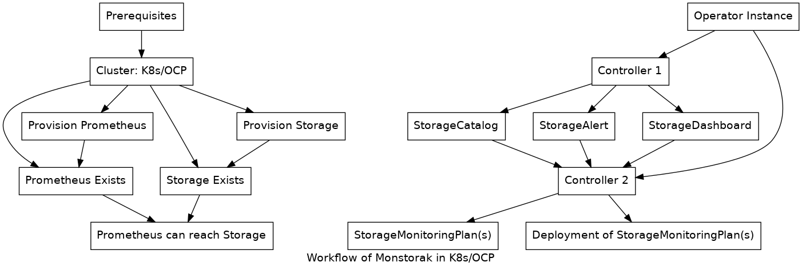

This document describes the actions that have to be executed successfully for
monstorak's CRDs to be considered reconciled. They are implemented as
`reconciler.Action` objects, and are enumerated in a `reconciler.Procedure`
object. Procedure level actions are ones that modify state and should have a
corresponding entry populated in
`.Status.ReconcileActions map[string]reconciler.Result`.

Top level actions are executed in an arbitrary order so they must define any
prerequisite actions explicitly.

An action may be a top-level action and still defined as a prerequisite and the
caching implementation will ensure that it is executed a maximum of once per
Procedure execution.



# StorageMonitoringPlan actions

## clusterMonitoringDeployed

## storageClusterDeployed

## monitoringEnabledForStorage

## deployStorageMixin

The monstorak operator consists of two controllers. The first one takes care of
getting the instanciating/reconciating customer resources like StorageCatalog,
StorageAlert and StorageDasboard. Once customer resources are available, the
second controller forms storage monitoring plans and executes them one by one
based on how many storage system and what artificats to be deployed.

# Deploy Operator with mixins
To deploy the operator simply deploy to your cluster. The set of steps to be followed
for deployment of monstorak operator and related artifacts, follow the below steps

## Create the namespace `storage-monitoring`
```
oc create -f deploy/kubernetes/01_namespace.yaml
```

## Create required cluster roles
```
oc create -f deploy/kubernetes/02_cluster-role.yaml
```

## Create cluster role binding
```
oc create -f deploy/kubernetes/03_cluster-rolebinding.yaml
```

## Deploy the operator
```
oc create -f deploy/kubernetes/04_operator.yaml
```

## Deploy the custom resources
```
oc create -f deploy/kubernets/05_storageAlerts.yaml
```

## Deploy the storage alert rules
```
oc create -f jsonnet/manifests/ceph-prometheus-rules.yaml
```
