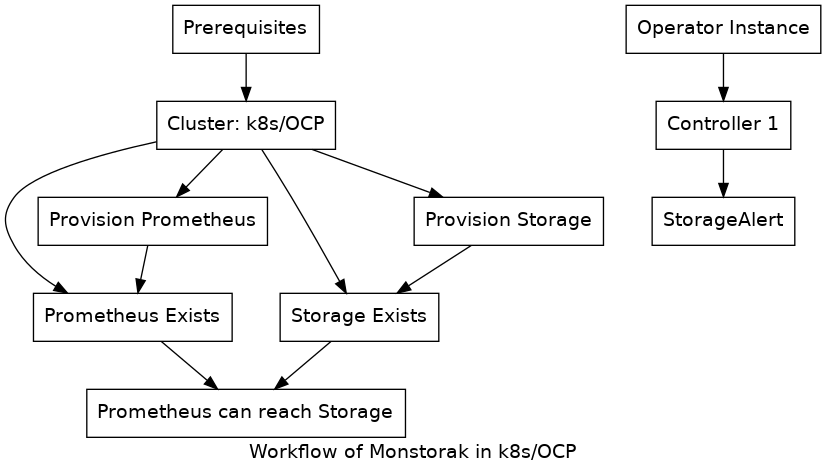

This document describes the actions that have to be executed successfully for
monstorak's CRDs to be considered reconciled.

# Pre-requisites

## Cluster monitoring deployed
This operator expects that cluster monitoring stack is already deployed in
k8s and all required services like prometheus and its related artifacts
are already available.

## Storage cluster deployed
The storage mixins (alerting rules) are meant for storage, so the operator
expects the storage stack to be deployed and available already. For example
the operator  takes care of deployment
of a ceph storage cluster.

## Monitoring Enabled For Storage
Prometheus should be able to scrape metrics from storage cluster.

# Deploy storage mixin
Mixins are used to write alerting rules and grafana dashboard templates in
kubernetes. For example the project 
provides the alerting rules for ceph storage system. The mixins use a templating
language called jsonnet for writting the alerting rules and grafana dashboard
templates, which ultimately needs to be compiled into prometheus rules YAML and
grafana dashboard JSON templates.

This operator take care of deploying the prometheus alerting rules generated out
of storage systems like 
in a kubernetes cluster.
